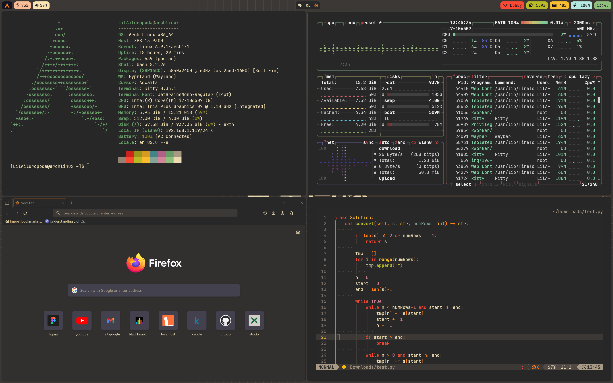

# GruvBox Hyprland Theme

## About

Configuration files for Hyprland & Waybar.

## Screenshot

.png'>)

## Installation

1. Backup your config files!
2. Replace the directories in ~/.config (exclude screenshots/ and wallpapers/ )
3. Place _wallpapers_ in ~/Pictures/ path
4. Restart your session

## Credit

1. https://github.com/morhetz/GruvBox
2. https://github.com/qxb3/gruvbox.hypr/tree/yume
3. https://github.com/0bCdian/Hyprland_dotfiles
4. https://github.com/theCode-Breaker/riverwm/tree/main/waybar
